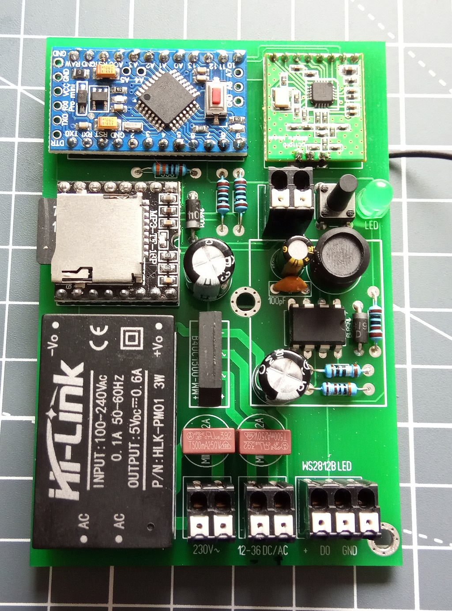
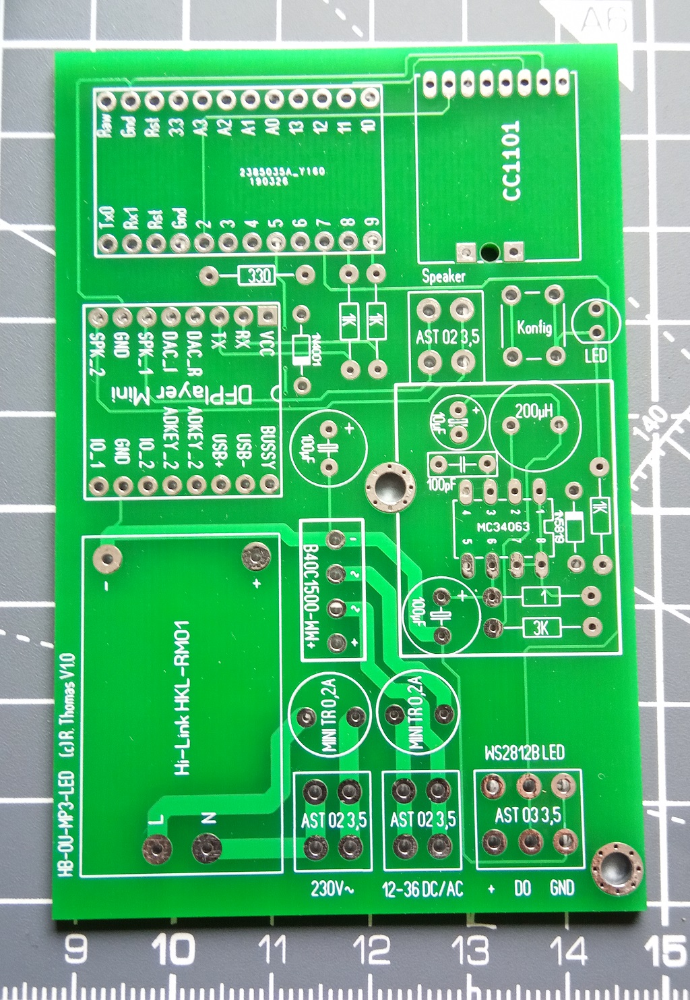
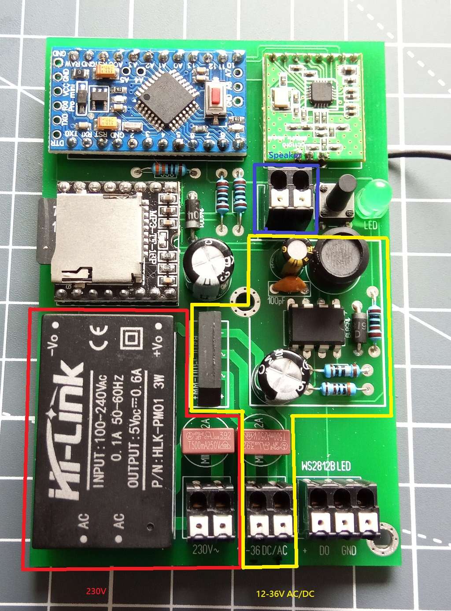

# MP3-Wiedergabe und LED-Signalisierung in HomeMatic
## benötigte Hardware
 * 1x Arduino Pro Mini **ATmega328P (3.3V/8MHz)**
 * 1x CC1101 Funkmodul **(868 MHz)**
 * 1x FTDI Adapter (wird nur zum Flashen benötigt)
 * 1x Taster 6*6				(TASTER 3301)
 * 1x DFPlayer Mini
 * 1x Micro SD-Karte
 * 1x LED 5mm					(LED 5MM GN)
 * 1x Widerstand 330 Ohm 1/4 Watt		(1/4W 330)
 * 2x Widerstand 1K Ohm 1/4 Watt		(1/4W 1,0K)
 * 1x Diode 1N4001				(1N 4001)
 * 1x Kondensator 100µF 50V RM3,5 		(RAD FR 100/50)
 * 1x Federkraftklemme 2-pol, Ø 1,5 mm, RM 3,5  (AST 02 3,5)
 * 1x Federkraftklemme 3-pol, Ø 1,5 mm, RM 3,5  (AST 03 3,5) für WS2812B LED
 * 1x Lautsprecher max 3 Watt 8Ohm

**Spannungsversorung 230V AC**

 * 1x Kleinstsicherung zum Einlöten, träge 0,2A (MINI TR 0,2A)
 * 1x Federkraftklemme 2-pol, Ø 1,5 mm, RM 3,5  (AST 02 3,5)
 * 1x Netzteil Hi-Link HLK-PW01 5V 3Watt 

**Spannungsversorung 12-36V DC/AC**

 * 1x Kleinstsicherung zum Einlöten, träge 0,2A (MINI TR 0,2A)
 * 1x Federkraftklemme 2-pol, Ø 1,5 mm, RM 3,5  (AST 02 3,5)
 * 1x Widerstand 1K Ohm 1/4 Watt		(1/4W 1,0K)
 * 1x Widerstand 3K Ohm 1/4 Watt		(1/4W 3,0K)
 * 1x Widerstand 1 Ohm 1/4 Watt			(1/4W 1,0)
 * 1x Kondensator 100µF 50V RM3,5 		(RAD FR 100/50)
 * 1x Kondensator 10µF 16V RM2,5 		(EB-A 10U 63)
 * 1x Keramik Kondensator 100pF  		(C3C0G 100P 200)
 * 1x MC 34063 A Step-Up/Down IC DIP-8		(MC 34063 A) 
 * 1x Schottkydiode, 40 V, 1 A, DO-41 1N5819 	(1N 5819)
 * 1x Stehende-Induktivität 220 µH RM5,0	(L-07HVP 220µ)
 * 1x Brückengleichrichter, 100 V, 2 A 		(B40C1500-WW+)

Artikelnummer in Klammern sind von Reichelt und nur eine Entfehlung.

Abmaße: 60mm*90mm

[Kontakt via Facebook](https://www.facebook.com/ronny.thomas.83)

[Kontakt via Homematic Forum](https://homematic-forum.de/forum/memberlist.php?mode=viewprofile&u=13127)

[Software](https://github.com/jp112sdl/HB-OU-MP3-LED)

